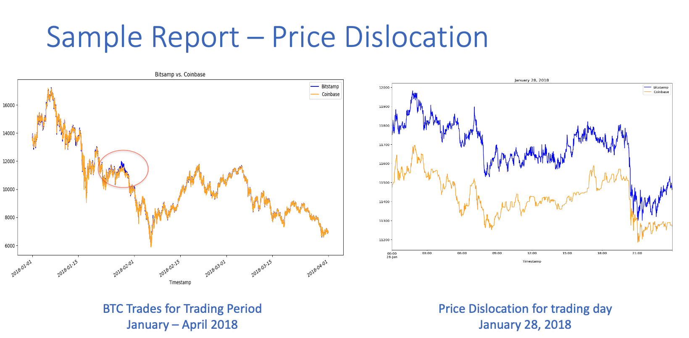

# challenge3
This script follows best practice to effectively collect, prepare and analyze data to find profitable trades for BTC between 2 exchanges (Bitstamp and Coinbase) over a 4 month trading period.  There are approximately 150,000 transacations that may present price dislocation and potential profitable arbitrage opportunities.  At the end of the script, you will find a report with an executive summary on the analysis, including assumptions, discoveries and identification of profitable trade opportunities.

---

## Technologies

This project leverages python 3.7.13 with the following tools:

Pandas

Pathlib

%matplotlib

---

## Installation Guide

No installation required

---

## Usage

The script will collect, prepare and analyze data identifying profitable
trading opportunities for arbitrage.  The required data exists as 2 separate CSV files in the 'Resources' directory.  At the end of the script, a report with analysis will be availalbe including assumptions, discoveries and total profit avaialble by trading day for arbitrage opportunities.

---

## Contributors

Dan Herman
Alameda Research
---

## License

MIT
